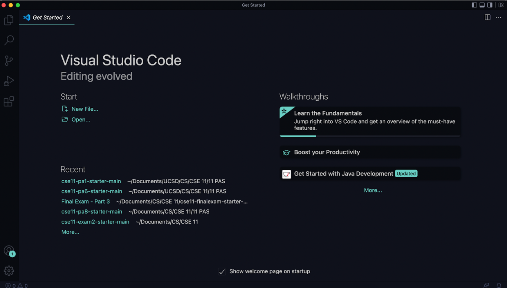

# week 2 - lab report 1
## by faith rivera
### april 10, 2022

--- 

## remote access - a beginners guide

For most beginners, we are often used to coding on our own personal computers and nothing else. But what happens if we want to collaborate with others or get access to code from our university? Oftentimes, we can connect **_remotely_** to a server on our own computer.  

In fancy terms- this step-by-step tutorial will teach you how to **_log into a course-specific account_** - more specifically the `ieng 6` server using our CSE 15L account. That way, you can easily use your computer to log in to the server using a **secure socket shell**.

---

### Step 1: Installing VScode




Visual Studio Code (VSCode) allows us to connect to the `ieng6` server remotely from our computer.  
To install, visit the Visual Studio Code website https://code.visualstudio.com/ and follow the instructions on the website to download the proper software for your device. Make sure you download the correct version for your operating system (ie: OSX, or Windows).

### Step 2: Remotely Connecting


Remotely connecting on our personal machine over the internet allows us to use a **server or course-specific account**.  
Before connecting: complete the following instructions if you are on **Windows software:**

1. Install the [OpenSSH program](https://docs.microsoft.com/en-us/windows-server/administration/openssh/openssh_install_firstuse). 
    -  This lets you connect your computer to other machines with the account.

Now, _all_ users (including non-Windows users) should find their course-specific account for CSE 15L at UCSD's account lookup: [https://sdacs.ucsd.edu/~icc/index.php](https://sdacs.ucsd.edu/~icc/index.php). I personally had two accounts- one for CSE 12 and 15L- so make sure that you use the correct one!  

We will now use this account to connect to the remote computer through VSCode's **remote option**.  
_(The following steps are based on VSCode's_ [_Connect to a remote host_](https://code.visualstudio.com/docs/remote/ssh#_connect-to-a-remote-host) _instructions.)_  
1. Open a terminal in VSCode (with shortcut Ctrl + ` or use the Terminal -> New Terminal in the menu bar)
2. Enter this command: after the `$`: `ssh cs15lsp22zz@ieng6.ucsd.edu` but replace the `zz` with the letters in your unique account name. In the terminal, it would appear as `$ ssh cs15lsp22zz@ieng6.ucsd.edu`.  

    If it's your first time entering into the server, you'll get this message: 
    ```
    The authenticity of host 'ieng6.ucsd.edu (128.54.70.227)' can'tbe established.

    RSA key fingerprint is
    SHA256:ksruYwhnYH+sySHnHAtLUHngrPEyZTDl/1x99wUQcec.

    Are you sure you want to continue connecting
    (yes/no/[fingerprint])?
    ```
    Type `yes` to confirm and press enter- then enter your password. 

### Step 3: Trying Some Commands

### Step 4: Moving Files with scp

### Step 5: Setting an SSH Key

### Step 6: Optimizing Remote Running

