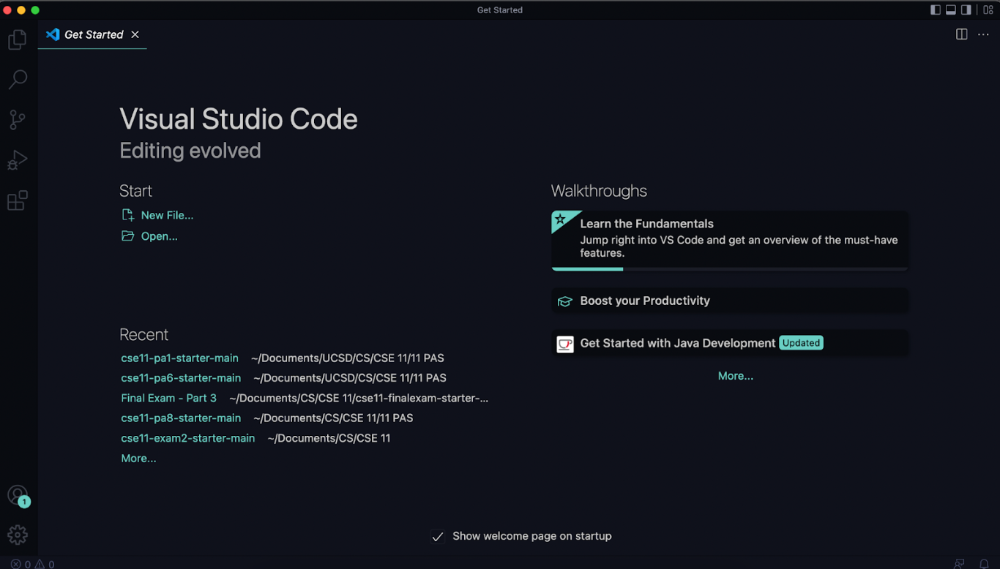
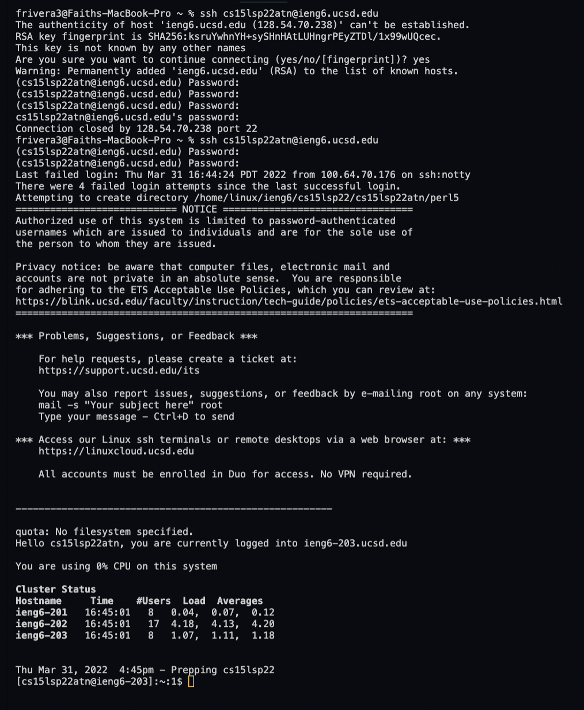
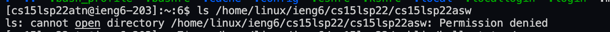
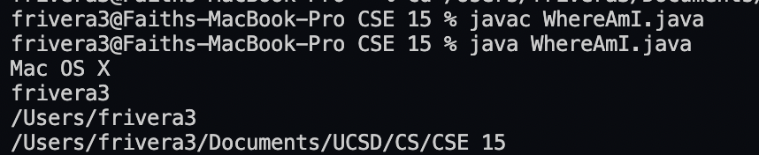
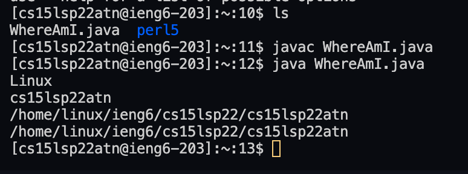

# week 2 - lab report 1
## by faith rivera
### april 10, 2022

--- 

## remote access - a beginners guide

For most beginners, we are often used to coding on our own personal computers and nothing else. But what happens if we want to collaborate with others or get access to code from our university? Oftentimes, we can connect **_remotely_** to a server on our own computer.  

In fancy terms- this step-by-step tutorial will teach you how to **_log into a course-specific account_** - more specifically the `ieng 6` server using our CSE 15L account. That way, you can easily use your computer to log in to the server using a **secure socket shell**.

---

### Stage 1: Installing VScode


Visual Studio Code (VSCode) allows us to connect to the `ieng6` server remotely from our computer.  
To install, visit the Visual Studio Code website https://code.visualstudio.com/ and follow the instructions on the website to download the proper software for your device. Make sure you download the correct version for your operating system (ie: OSX, or Windows).

### Stage 2: Remotely Connecting
Remotely connecting on our personal machine over the internet allows us to use a **server or course-specific account**.  
Before connecting: complete the following instructions if you are on **Windows software:**

1. Install the [OpenSSH program](https://docs.microsoft.com/en-us/windows-server/administration/openssh/openssh_install_firstuse). 
    -  This lets you connect your computer to other machines with the account.

Now, _all_ users (including non-Windows users) should find their course-specific account for CSE 15L at UCSD's account lookup: [https://sdacs.ucsd.edu/~icc/index.php](https://sdacs.ucsd.edu/~icc/index.php). I personally had two accounts- one for CSE 12 and 15L- so make sure that you use the correct one!  

We will now use this account to connect to the remote computer through VSCode's **remote option**.  
_(The following steps are based on VSCode's_ [_Connect to a remote host_](https://code.visualstudio.com/docs/remote/ssh#_connect-to-a-remote-host) _instructions.)_  
1. Open a terminal in VSCode (with shortcut Ctrl + ` or use the Terminal -> New Terminal in the menu bar)
2. Enter this command: after the `$`: `ssh cs15lsp22zz@ieng6.ucsd.edu` but replace the `zz` with the letters in your unique account name. In the terminal, it would appear as `$ ssh cs15lsp22zz@ieng6.ucsd.edu`.  

    If it's your first time entering into the server, you'll get this message: 
    ```
    The authenticity of host 'ieng6.ucsd.edu (128.54.70.227)' can'tbe established.

    RSA key fingerprint is
    SHA256:ksruYwhnYH+sySHnHAtLUHngrPEyZTDl/1x99wUQcec.

    Are you sure you want to continue connecting
    (yes/no/[fingerprint])?
    ```
    Type `yes` to confirm and press enter- then enter your password. If you successfully log in, you should see a message below the password input like this:
    ```
    Last login: Sun Jan  2 14:03:05 2022 from
    107-217-10-235.lightspeed.sndgca.sbcglobal.net

    quota: No filesystem specified.

    Hello cs15lsp22zz, you are currently logged into
    ieng6-203.ucsd.edu


    You are using 0% CPU on this system

    Cluster Status
    Hostname     Time    #Users  Load  Averages
    ieng6-201   23:25:01   0  0.08,  0.17,  0.11
    ieng6-202   23:25:01   1  0.09,  0.15,  0.11
    ieng6-203   23:25:01   1  0.08,  0.15,  0.11

    Sun Jan 02, 2022 11:28pm - Prepping cs15lsp22
    ```

Sometimes, your password might be incorrect (you can see that I had this issue many times below). You'll have a maximum of 4 tries before you are logged out and must complete Step 2 of this stage again. If you continue to have issues, check if your password is correct or change it [here](https://sdacs.ucsd.edu/~icc/index.php). It's totally okay if it doesn't work the first few times- as you can see in my photo, it took _a lot_ of tries!



After you recieve the correct message, you are logged in as a client! 
### Stage 3: Trying Some Commands

Once you're logged into the server, you can use several commands on your remote computer and on your personal computer. Some of these commands can let you transfer files between the two!

Some commands to experiment with:
- `cd~`
- `cd` (change directory)
- `ls -a` (list all files)
- `ls -lat` (list all files by date- a triple command!)
- `ls <directory>` where `<directory>` is
`/home/linux/ieng6/cs15lsp22/cs15lsp22abc,` where the `abc` is one
of the other group members’ username. You shouldn't be able to access it because you're not logged in! See the picture below for reference:

  

- `cp /home/linux/ieng6/cs15lsp22/public/hello.txt ~/` (copies a file)
- `cat /home/linux/ieng6/cs15lsp22/public/hello.txt` (view or create a file)
- `rm` (remove)

### Stage 4: Moving Files with scp

The commands we experimented with in the previous stage are some ways we can work on our personal and remote computers. But we haven't quite touched an important part of working remotely: **copying files back and forth between the two computers.** We do so between your personal and remote computer using the `scp` command.

We can test it out by creating a file called `WhereAmI.java` with the following code:

```
class WhereAmI {
    public static void main(String[] args) {
        System.out.println(System.getProperty("os.name"));
        System.out.println(System.getProperty("user.name"));
        System.out.println(System.getProperty("user.home"));
        System.out.println(System.getProperty("user.dir"));
    }
}
```
This code will allow us to see where the code is being run on: **your personal computer** or your **remote client computer**. If you run it on your computer using `javac` and `java` (in a separate terminal to the one we've been using), it'll show you your own computer's software, directory, name, etc.

From here, enter the command `scp WhereAmI.java cs15lsp22zz@ieng6.ucsd.edu:~/` (with the zz being the letters in your account name) and log in with your account and password. If your login is successful, you'll be able to see it in your directory, as well as run `javac` and `java` on your remote computer.

You can see the difference of the java file outputs between my two computers:

**Personal computer output:**


**Remote client computer output:**


My personal computer uses Mac OS X software, while the remote client computer uses Linux software- they're two different locations on one machine! How cool :D

### Stage 5: Setting an SSH Key

### Stage 6: Optimizing Remote Running

