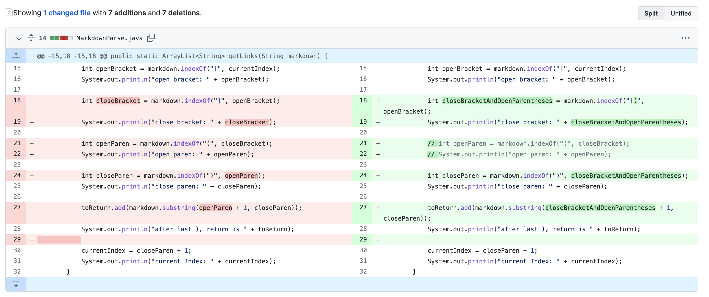
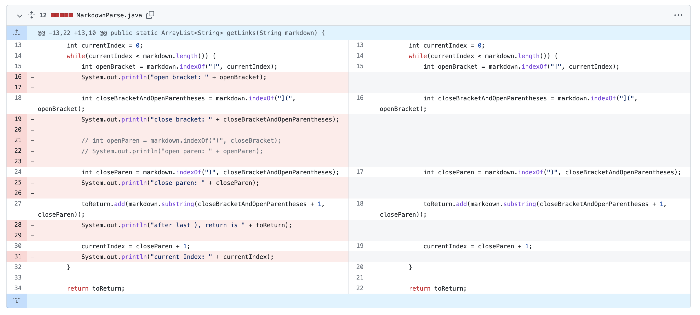
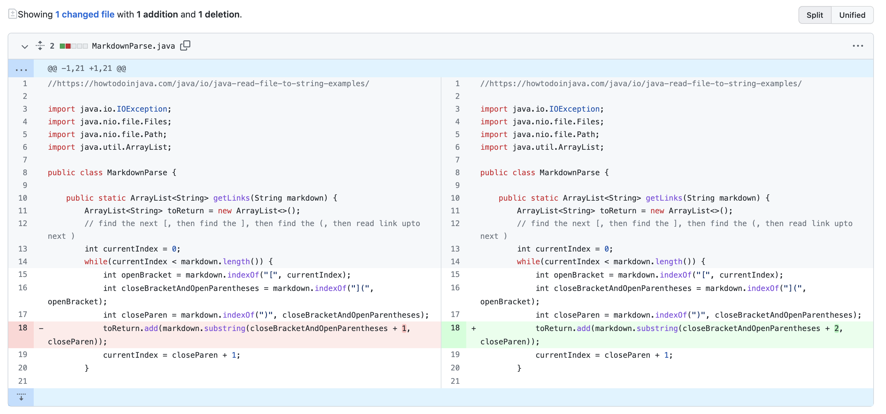
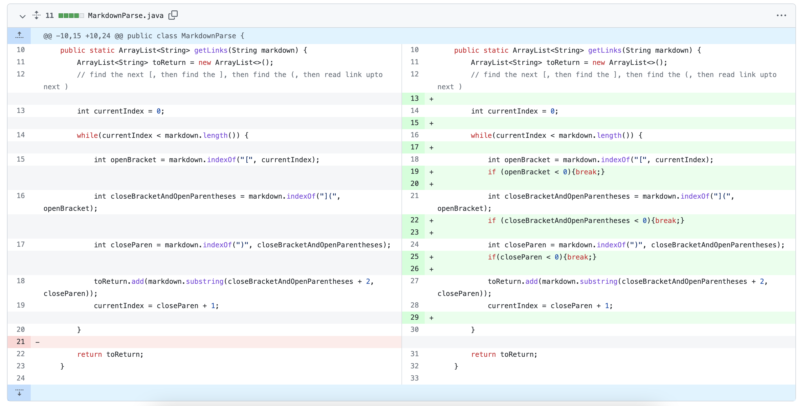
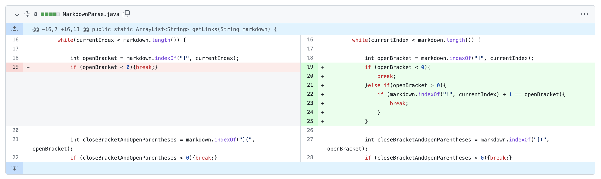

# week 4 - lab report 2
## by faith rivera
### april 22, 2022

--- 

## debugging code 

  
<p align="center">
  
</p>

Let's face it: bugs in code are inevitable. We often must recheck our work and fix issues in our code to make sure it runs as expected.

The following blog post will show examples of analyzing code and its failure-inducing inputs to find bugs and fix them. 

All fixes were done on a java file called [**`MarkdownParse.java`**](https://github.com/nidhidhamnani/markdown-parser/blob/main/MarkdownParse.java), whose purpose is to print a list of all the links in a markdown file that are formatted with Markdown link syntax. For instance, when we have this Markdown file code:

```
# Title
[link1](https://something.com)
[link2](some-thing.html)
```
Then MarkdownParse.java should print the following when run:
```
[https://something.com, some-thing.html]
```

---

## example one: making sure [] and () are connected for link format
When initially running the code on the file [**`testFR_filePt3.md`**](https://github.com/fnriv/markdown-parser/blob/main/testFR_filePt3.md), the output for the file was `[coolmath, https://twitter.com/?lang=en]` when it should have been `[https://www.coolmathgames.com/, https://twitter.com/?lang=en]`.

This incorrect output, or **_symptom_**, was due to the java file only looking for the symbols "[", "]", "(", and ")". In this case, the **_failure-inducing input_** was that when brackets or parentheses were outside of the actual link format, it would recognize it to be part of the link syntax and proceed to find the nearest pair of parentheses.

To fix this, I made the java file look for the following strings of symbols: "[", then "](", then ")", as shown in the code change diffs below. It shows how I used print statements to find the errors, then how I changed the code to fix the bug. 


I added testing print statments as well as changed the symbols the code searched for (`closeBracket` was joined with `openParen` to be `closeBracketAndOpenParentheses`).

I cleaned up my code to take out the testing print statments; but realized my indexing for `closeBracketAndOpenParentheses` was incorrect: the output included the "(" in the output for the links.

I fix my indexing for `closeBracketAndOpenParentheses` so that the print statment will not include the "(" in the list.

After making these changes, the output was correct and the symptom was gone, meaning that this bug was fixed!

---

## example two: fixing infinite loops
After fixing this bug, I proceeded to run `MarkdownParse.java` on the [**`testFR_fileLastLine.md`**](https://github.com/fnriv/markdown-parser/blob/main/testFR_fileLastLine.md). This file has the **failure-inducing input** of having an extra blank line at the end of the Markdown file, which means the java program will enter an infinite loop looking for the next open bracket. This resulted in the following **symptom** output:

```
Exception in thread "main" java.lang.OutOfMemoryError: Java heap space
        at java.base/java.lang.StringLatin1.newString(StringLatin1.java:766)
        at java.base/java.lang.String.substring(String.java:2708)
        at MarkdownParse.getLinks(MarkdownParse.java:18)
        at MarkdownParse.main(MarkdownParse.java:29)
```
To fix this bug, I made the code store the indexes of the 3 strings into variables in the loop. Then, if any of the variables had the value of -1, the loop would break. This is shown in the code change diff below.



This ensures the MarkdownParse method will work even if the link isn't the last text in the file.

---

## example 3: image links
In this version of `MarkdownParse.java`, we were instructed to _not_ include image links in the output list. Thus, I realized that when I ran my updated version of `MarkdownParse.java` on the Markdown file [**`testFR_file4.md`**](https://github.com/fnriv/markdown-parser/blob/main/testFR_file4.md), the **failure-inducing input** (the image link in Markdown format) resulted in the following bug symptom output:

```
[https://media.istockphoto.com/photos/carboard-box-wclippping-path-picture-id157318026?k=20&m=157318026&s=612x612&w=0&h=mTVCRfqtS2zKtbfKu_duQy5mvegvJqs8Z7mgQlZ06ck=]
```

when it should only be `[]`.

As a result, I changed the code to not add links if the open bracket of the link had a `!` before it (by checking the index before if there was a character before). This is evidenced by the code change diff below:



After making these changes, the code was fixed: all possible bugs were squished and fixed. This was affirmed by multiple tests with other files, which can be seen [here](https://github.com/fnriv/markdown-parser/blob/main/MarkdownParseTest.java)!