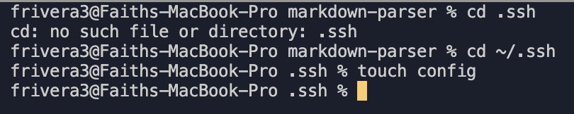
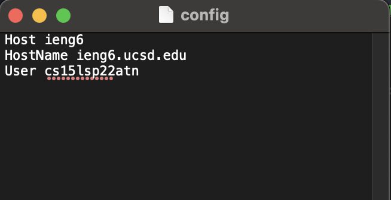
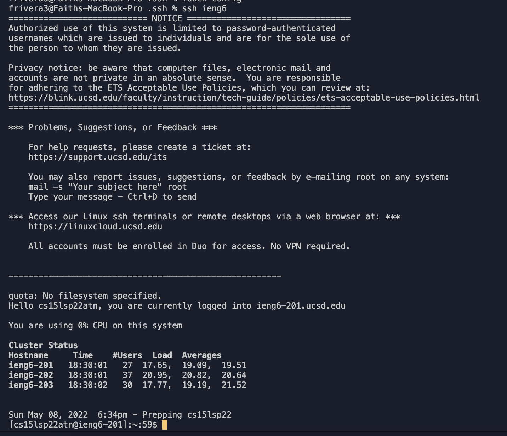
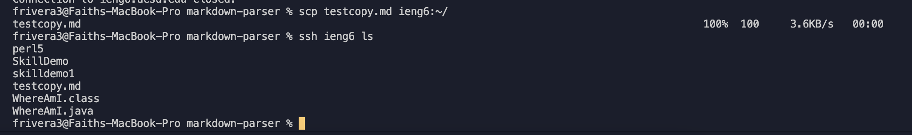
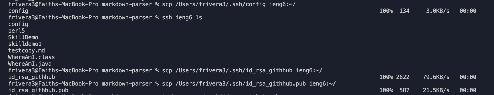
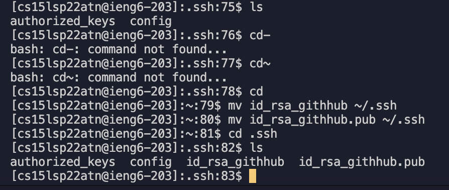
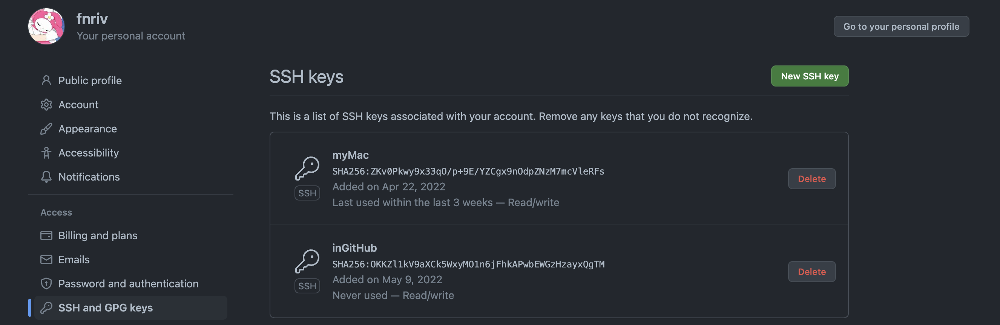
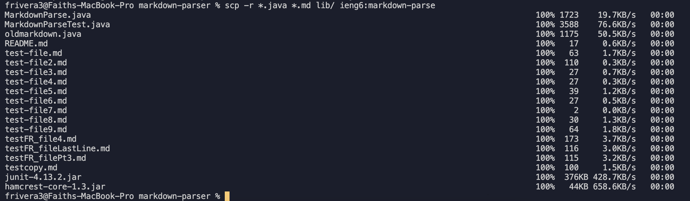
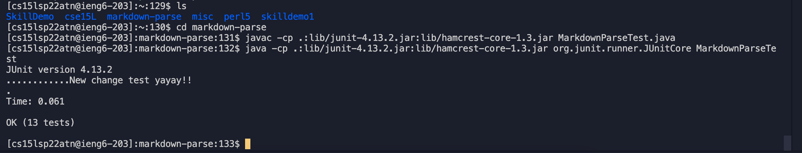
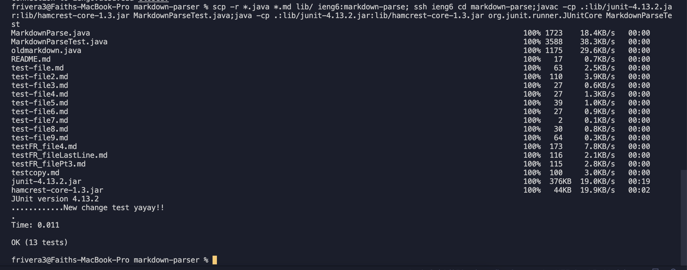

# week 6 - lab report 3
## by faith rivera
### may 8, 2022

--- 

## working across ssh and remote servers


<p align="center">
  
</p>

We're back in the network! So far, we've learned about ssh keys, transferring data, and even how to make changes and debug our code. This week, we will dive further into improving our experience in connecting and exporting data and files across different computers.

As a preface: all work on this blog post is done on a **Mac** computer to work with the `ieng6` system. When connected to my `ieng6` account, it is done on Linux software. Thus, some commands can vary if your personal computer is a Mac or Windows device.

---

## 1: Streamline `ssh` Configuration
Although using a `ssh` key definitely speeds up the login process, we still must type in a long string similar to `$ ssh cs15lsp22zzz@ieng6.ucsd.edu`. It's still a lot to memorize! Luckily, using a `config` file allows us to speed up the process even more by sharing information about specific servers to our key.

To do so, we first ensure that we have a `config` file in our `ssh` folder.

 To check if you have a `config` file: 
 1. Change your directory to `ssh`: `cd ~/.ssh`
 2. Open `~/.ssh/config`. If you can't in the terminal, You can open it manualy through Mac Finder like I did in the photo below.
 
 3. Add the following lines to your `config` file:
``` 
Host ieng6
HostName ieng6.ucsd.edu
User cs15lsp22zzz (use your username)
```
Refer to the photo below to match:


The first line `Host` can be changed (from `ieng6` to something else) - this is what the computer uses to recognize where to log into. 

Once you save to the file, you should be able to type the following to log in with your `ssh` key becuase of the specific login domain and username you put in `config`:

`ssh ieng6`

The computer will thus log you in and display a message like below.


To test if it works, I used the `scp` command on a Markdown file. Below, you can see it was successfuly copied over when I called the `ls` command with my ssh key:


---

## 2. Set up Github Access from ieng6

If we want to `commit` and `push` using `git` on the command line terminal, we have to use some sort of authentication system to push changes. To do so, we can use our `ssh` key to give our `ieng6` computer access to Github.

Since we haven't used Vim yet, we can use the `scp` command to create a key linking to GitHub on our own computer and then copy it to our `ieng6` account. I did so by using `ssh-keygen` to create a key on my personal computer, then adding key information to my `~/.ssh/config` file, then using the `scp` command to transfer it to my `ieng6` account. (As seen below.)



Now, when I use the `ls` command, I can see the `~/.ssh/config` file, as well as my public and private key on my `ieng6` user account:



Then, I set up my `ssh` key on GitHub following [this tutorial.](https://docs.github.com/en/authentication/connecting-to-github-with-ssh/adding-a-new-ssh-key-to-your-github-account). Once it's set up, you should be able to view your key in your account settings and clicking on **SSH and GPG keys**:


We know this works when we can use `git push` on our `ieng6` account:


---

## 3: Copy whole directories with `scp -r`

Sometimes we want to transfer entire directories to our remote account, but it would be daunting and time consuming to use the `scp` command on the files one by one. Thus, we cam use the `scp -r` command to do so recursively.

You can use your `ssh` key to easily transfer the contents, as well as this specific syntax so that it will only list the visible files (so not the files hidden in `git`):

```
⤇ scp -r *.java *.md lib/ ieng6:markdown-parse
```

The terminal will return something like so:


After, we can enter our `ieng6` account and use `javac` and `java` to run our tests like so:


We can even run our `scp -r`, `javac`, and `java` command on one line! Make sure the `scp -r` command is before your `ieng6` commands- it must be done from your personal computer so you can transfer the files _from_ there. Make sure also to use the `cd` command so you can run your `javac` and `java` commands in the right directory. 

An appropriate one-line command is similar to this:
```
scp -r *.java *.md lib/ ieng6:markdown-parse; ssh ieng6 cd markdown-parse;javac -cp .:lib/junit-4.13.2.jar:lib/hamcrest-core-1.3.jar MarkdownParseTest.java;java -cp .:lib/junit-4.13.2.jar:lib/hamcrest-core-1.3.jar org.junit.runner.JUnitCore MarkdownParseTest
```

It results in terminal feedback like this!


That way, you can compress your commands to one step to occur on one go!