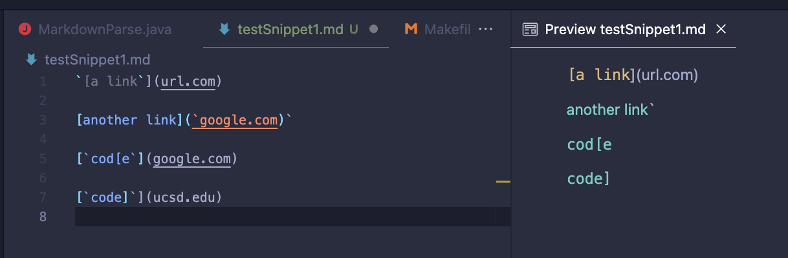
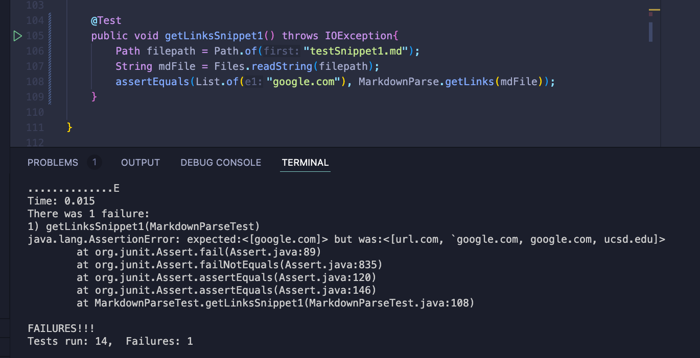
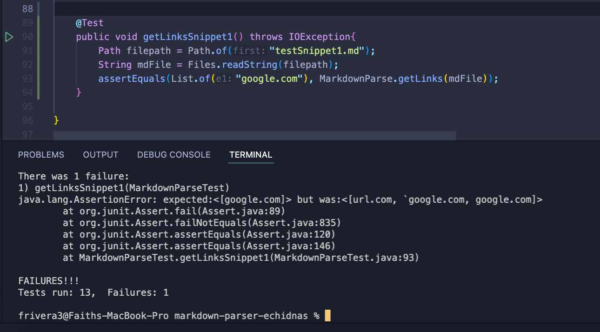
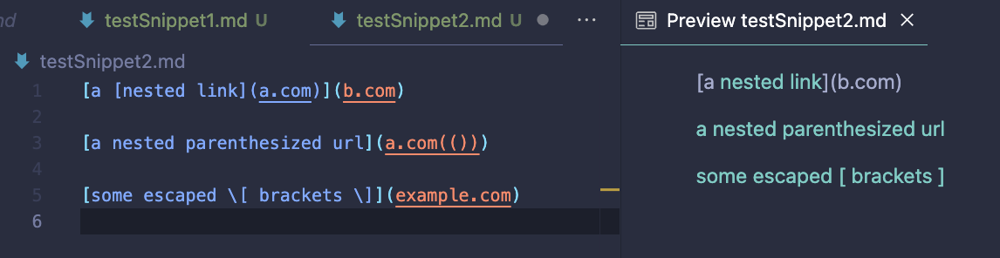
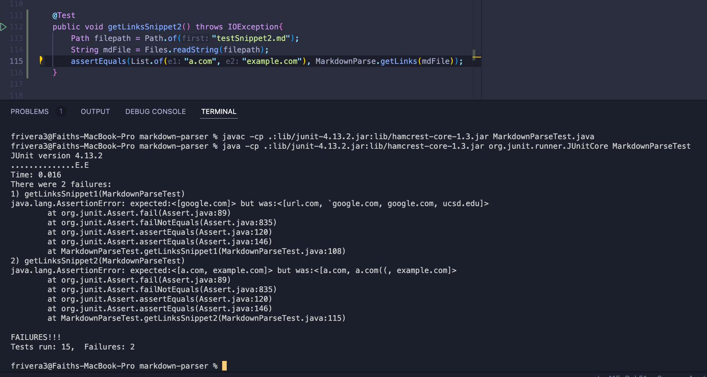
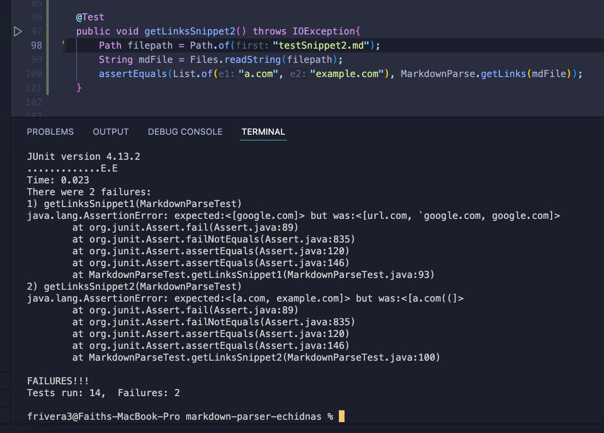
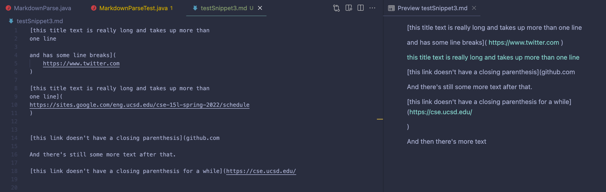
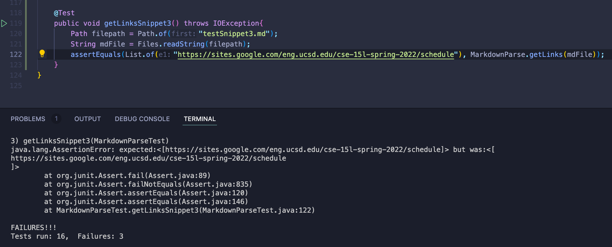
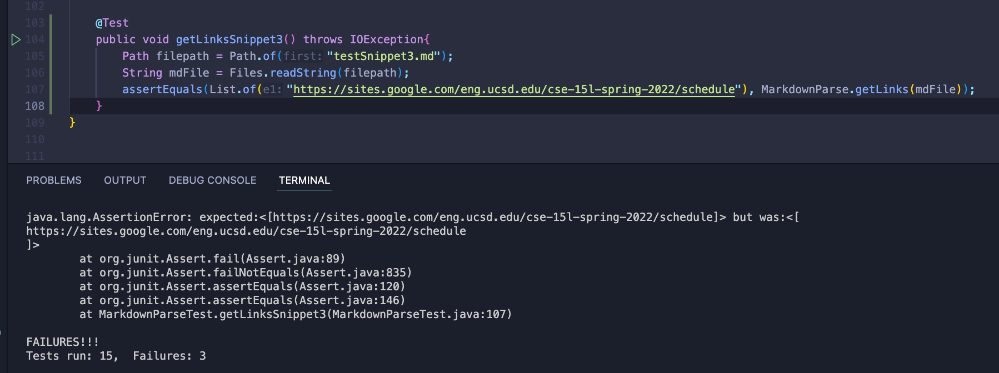

# week 8 - lab report 4
## by faith rivera
### may 22, 2022

--- 

## editing code (markdown parser)

  

This week, we will be comparing implementations of `MarkdowmParse.java` based on 3 snippets of Markdown code. I will be reviewing [my repo](https://github.com/fnriv/markdown-parser) as well as the repo for [team Echidnas](https://github.com/AlexVazquez19/markdown-parser-echidnas).

## Snippet 1

When I create a Markdown file of Snippet 1, the preview of the file looks like this:

This means that based on the preview, the expected output of a `MarkdownParse.java` test would be the array **[google.com]**. The Google link is recognized from the second google link in the file.

**Test and results for Snippet 1 in my own `MarkdownParseTest.java`:**

**Test and results for Snippet 1 in team Echidnas `MarkdownParseTest.java`:**

As evidenced by the stack traces, both tests did not pass. 

I think there is a small code change that will allow links to be formatted in grave accents within the brackets. The code can be fixed to check if one of the grave marks is before the brackets (meaning that its formatting is prioritized), so that if it is, it will focus on the code format instead of the link format.

---

## Snippet 2

When I create a Markdown file of Snippet 2, the preview of the file looks like this:

This means that based on the preview, the nested link will be prioritized. However, parentheses sometimes hold special meaning, so because they might need to be encoded they will not always be accepted as a valid link. Thus, link 2 should not be added to the returned array when the file is parsed through (which is also due to the nested parentheses). The expected array to be returned would be **`[a.com]`**.

**Test and results for Snippet 2 in my own `MarkdownParseTest.java`:**

**Test and results for Snippet 2 in team Echidnas `MarkdownParseTest.java`:**

As evidenced by the stack traces, both tests did not pass, for different reasons. Both accept `a.com((` as a link, but the Echidnas' `MarkdownParse.java` does not allow for the prioritization of nested links or brackets inside of the first link (since there is an extra `]` separating the first `]` from the parentheses).

I do not think it would be possible to have a short-code fix for this snippet for the nested brackets or parentheses. Although we can check if there is space in between the brackets and parentheses, checking for the nested links would require more variables tracking whether or not a link is completed within a link bracket. Furthermore, you would have to account for triple or quadruple nesting or more.

---

## Snippet 3

When I create a Markdown file of Snippet 3, the preview of the file looks like this:

This means that based on the preview, only the multi-line link will be recognized. The expected output from `MarkdownParse.java` should be **`[https://sites.google.com/eng.ucsd.edu/cse-15l-spring-2022/schedule]`**. Although some of the other links are accessible (colored in blue), they are not embedded in text.

**Test and results for Snippet 3 in my own `MarkdownParseTest.java`:**

**Test and results for Snippet 3 in team Echidnas `MarkdownParseTest.java`:**

Both tests fail because `MarkdownParse.java` includes the newline characters when parsing. This can be solved by continuing the parse if there is a newline or empty line to avoid the formatting from being added to the returned array.