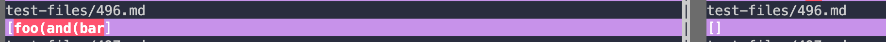
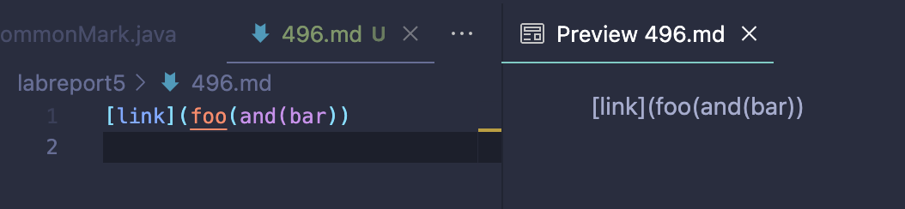
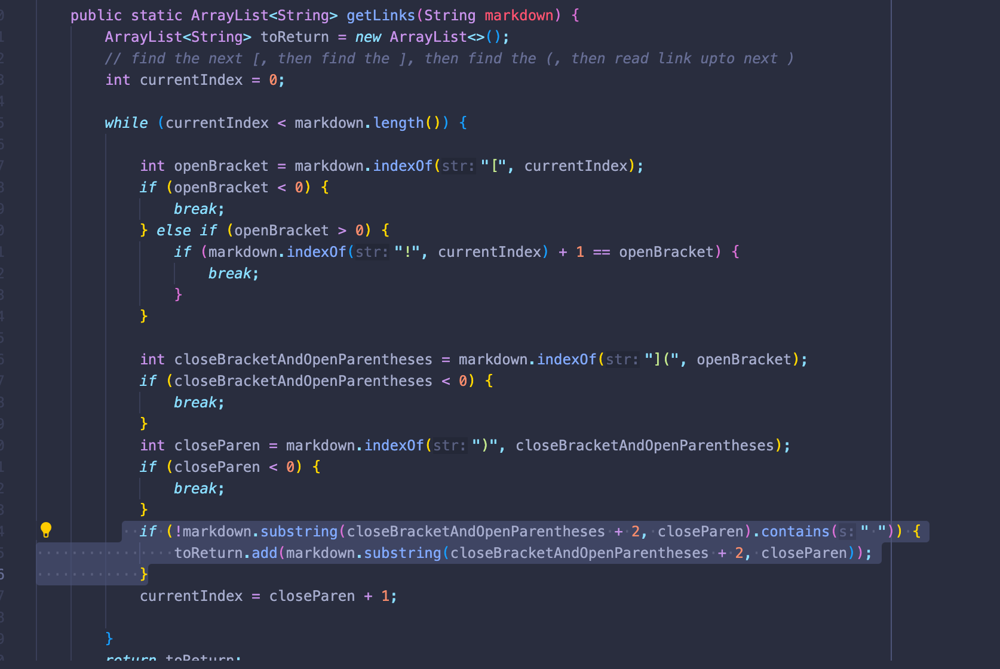
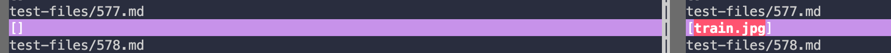
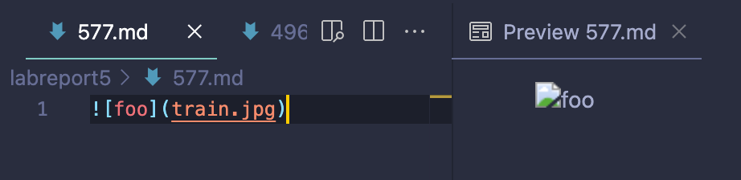
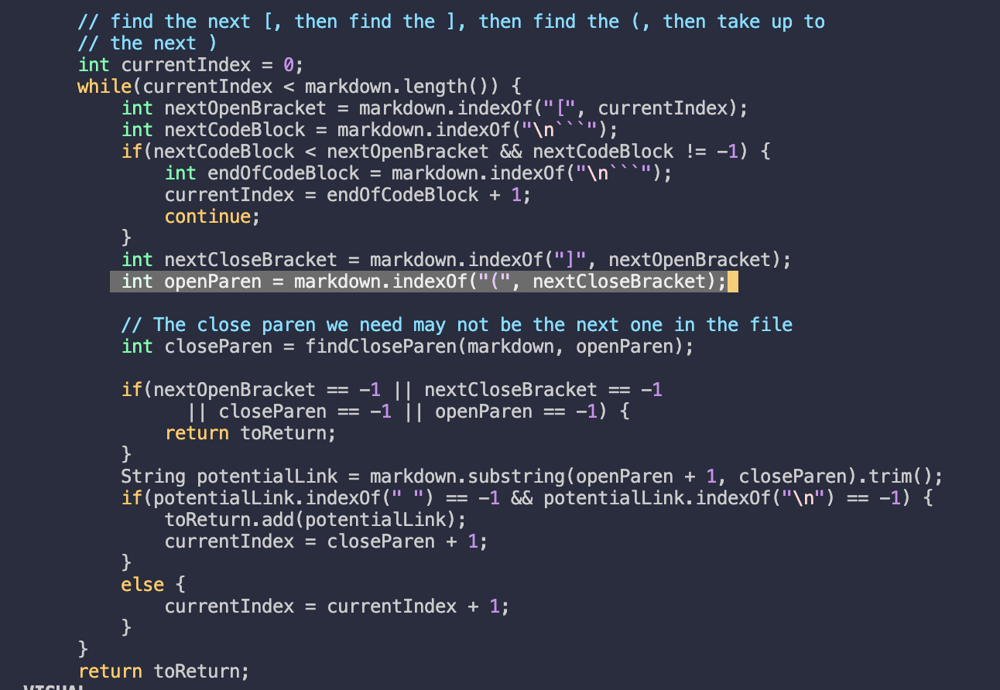

# week 10 - lab report 5
## by faith rivera
### june 5, 2022

--- 

## comparing code outputs on multiple files (markdown parser)

  

We're closing off our labs for CSE 15L with one last way to compare and debug multiple test cases for `MarkdownParse.java`. I will be comparing two tests from the `test-files` directory to compare its output on different implementations of `MarkdownParse.java` on my `ieng6` account.

To do this, I will be using the test files `577.md` and `496.md`. I used `vimdiff` to compare the outputs of the files when run through the different parsers as shown below. I'll break down each test file's outputs, the expected output, and possible bug solutions to produce the correct output.

---

### `test-files/496.md`
Below is the `vimdiff` file comparison when `496.md` is run through my `MarkdownParse.java` (left) and the provided `MarkdownParse.java` (right). 

_For reference, [here](https://github.com/nidhidhamnani/markdown-parser/blob/main/test-files/496.md) is the link to `496.md` from the provided repository._

This is what the file looks like compared to the preview version on VSCode:

Since the preview shows no valid link, I can conclude that the implementation of `MarkdownParse.java` on the **right** (the provided parser) correctly parses through `496.md` because it does not add `foo(and(bar)` as a link in the returned array. In other words, the CSE15L-provided `MarkdownParse.java` provides the expected and correct output of an empty array (since ther are no valid links), and mine does not.

I think my code returns the wrong output because it does not check if the text inside the outermost pair of parentheses is a valid link. My parser recognizes all of the text in the outermost parentheses, but does not evaluate if it is a link. I would need to add code to check if the String has a `.` and other important symbols required of a link before adding the String to the array returned by the parser. I can add this code to the highlighted part of my code shown below:

This is where the String is being evaluated for spaces and other characters that should or should not be in the link String.

---

### `test-files/577.md`
Below is the `vimdiff` file comparison when `577.md` is run through my `MarkdownParse.java` (left) and the provided `MarkdownParse.java` (right). 

_For reference, [here](https://github.com/nidhidhamnani/markdown-parser/blob/c7680904bc390e500c7c98e4789d1410249c2982/test-files/577.md) is the link to `577.md` from the provided repository._

This is what the file looks like compared to the preview version on VSCode:

Since the link in `577.md` is an image link, it technically should not be recognized as a valid link and should not be added to the array returned by the parser. Thus, my own implementation of `MarkdownParse.java` produces the expected and correct output of an empty array, while the CSE 15L-provided implementation does not. 

I think the CSE 15L code returns the wrong output because it does not check if there is a `!` before the first square bracket. The parser correctly parses all of the text in the parentheses, but does not evaluate if it is an image link. I would need to add code to check if the value of the index of the link string before the saved index for the first open is a `!`. I can add this code to the highlighted part of my code shown below:

This would evaluate if the link is for an image. If it is, it will not add the link to the array returned by the parser, thus fixing the bug in the CSE 15L provided implementation.

---

That concludes my last lab report for the quarter- thank you! 

  

